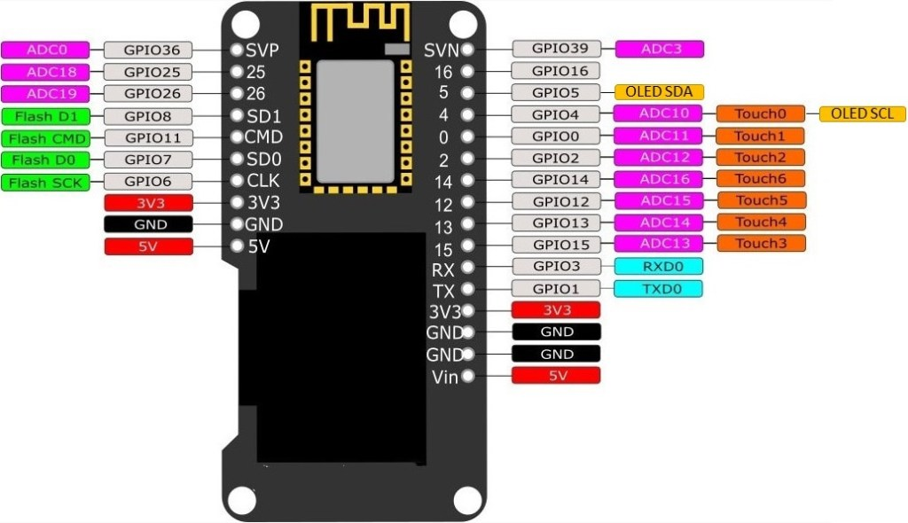
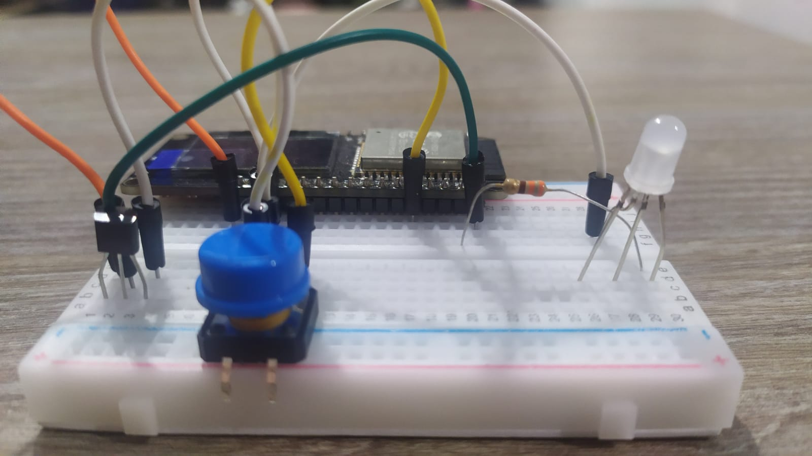
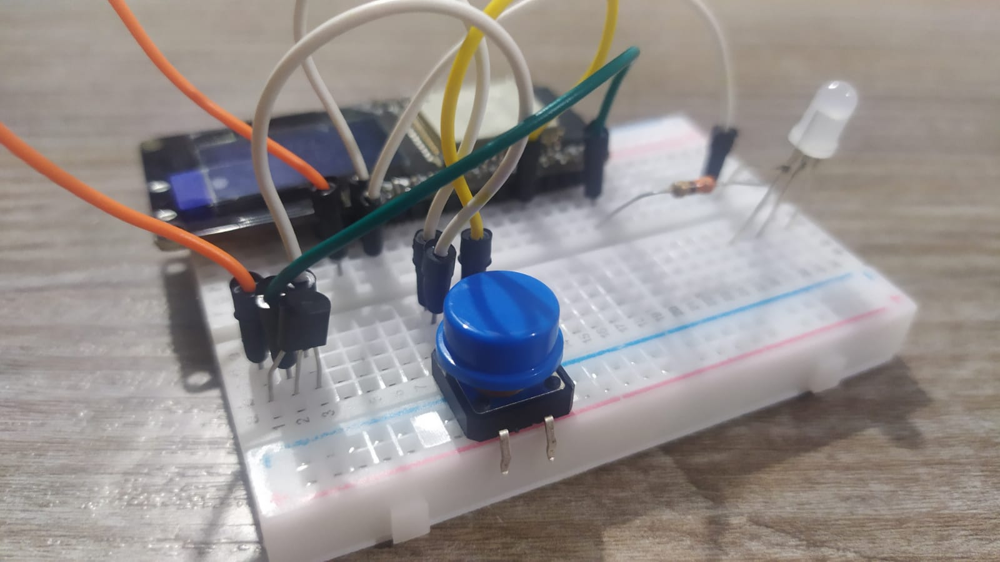
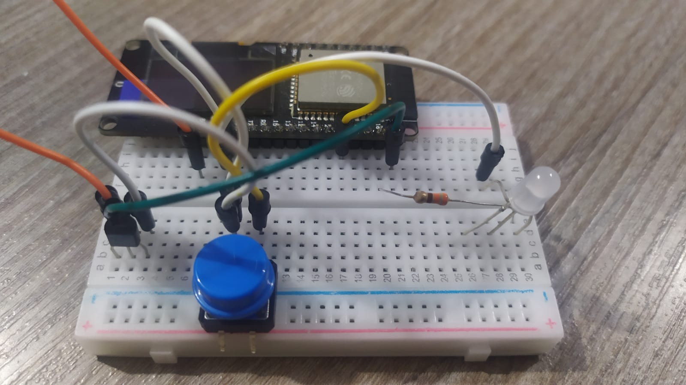
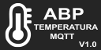

# ABP - Temperatura com MQTT e mapa de calor

## Funcionamento
O hardware se conectará em um wi-fi e a cada periodo de tempo publicará a temperatura do sensor LM35.
O hardware assinará o tópico `device/id/realtime` para receber todas as temperaturas dos outros hardwares, de acordo com as configurações de IDs.
O hardware tambem assinará o tópico de configuração para receber os parâmetros de periodo, IDs monitorados (até 5) e coordenadas (se necessário).
No circuito também possui um LED de status de conexão no broker MQTT e um botão para trocar de tela.

## Dependências
* Biblioteca OLED, foi copiada deste link e removida parte de SPI.
<a href="https://github.com/nopnop2002/esp-idf-ssd1306.git">Link da bliblioteca do OLED</a>

* Gerador de vetor a partir de imagem:
<a href="https://javl.github.io/image2cpp/">image2cpp</a>
```
Configuração: 128x64.
background: white
Flip: vertical
``` 

## Estrutura dos dados

### JSON Publicado no realtime (Publish)
Na rota do broker: `device/${id_placa}/realtime`.
* O `ID` talvez nem precisaria mas facilitara o frontend pra não precisar ler quem enviou o realtime no tópico.
```
{
"id": 1,
"description" : "Casa do Jonas"
"temp": 27.1,
"period" 30,
"Long": -49.43364752,
"Lat": -28.701026
}
```

### JSON esperado na rota de configuração (Subscribe)
# @audit PENDENTE receber configuração.
Na rota do broker: `device/${id_placa}/config`
```
{
   "period" 30,
   "Long": -49.43364752,
   "Lat": -28.701026,
   "description" : "Casa do Jonas",
   "id_sub" : [2,3,4,5,6]
}
```

## Adicionar links de referência
* Parte de MQTT: <a href="https://github.com/jonasgeremias/Material-ESP32">Link do GitHub</a>

## Pendências para o hardware
* Certificado SSL para conectar no broker.
* Usuário e senha de acesso para regras ACL. Poderia ser: `User: "device-${id}" , senha: "password-${id}"`.
* link e porta do broker.
* Montar a tela no LCD. 

## Como melhorias:
* Implementar OTA : usando a rota de config pra sinalizar.
* Usar NVS para salvar as informações.
* Criar web server local para visualização dos dados.
* Desenvolver o Wifi Manager para configuração do wi-fi.


## Tutorial para implementação do MQTT

### Instalando o Mosquitto:
1. Instalar o mosquitto em <a href="https://mosquito.org/">mosquito.org</a>
2. Adicionar os arquivos dlls.
3. Configurar o PATH do Mosquitto nas variáveis de ambiente do Windows: inserir no PATH o link do diretorio da instalação do Mosquitto. Ex.: `C:\Program Files\Mosquitto\mosquitto_pub.exe`
4. Configurar o serviço do Mosquitto para inicialização manual em `services.msc`.
5. Testar a instalação do Mosquito com o comando mosquito -–help

### Testando manualmente:
Acessar a pasta da instalação e abrir 3 CMDs:
* Broker: `mosquitto -v -p 1883`
* Sub: `Mosquitto_sub –h localhost –p 1883 –t /topic/subtopic`
* Pub: `mosquitto_pub –h localhost –p 1883 –t /topic/subtopic –m teste`

####  Caracteres Curingas:
* Usar o `#` é utilizado para permitir todos os 
níveis subsequentes da hierarquia. Ex.: `topic/#`. 
* Usar o `+` é utilizado para permitir um único nível. Ex.: `+/subtopic`. 
* Para receber as mensagens de status do broker assine o tópico: `$SYS/#`.
* Para receber todas as mensagens dos clientes MQTT assine o tópico: `#`.

### Configuração do Broker
* Iniciar o Broker com arquivo de configuração: `mosquitto -c mosquitto.conf –v`. Ou `mosquitto -c C:\Users\Jonas\Documents\ProjetosESP32\Material-ESP32\MQTT-LM35\Broker_MQTT\mosquitto.conf –v`

#### Criar usuário ADMIN
* Execute o comando `mosquitto_passwd -c passwordfile.pwd admin` para criar um usuário chamado admin inserir uma senha: Ex.: `abc`.
* No arquivo `mosquitto.conf`, coloque `allow_anonymous false`para bloquear acessos anónimos.
* No arquivo `mosquitto.conf`,  na seção `Default authentication and topic access control` tire o comentário do comando
`password_file` e adicione o link do arquivo `passwordfile.pwd`.
    * Para _adicionar_ um usuário: `mosquitto_passwd -b passwordfile.pwd user1 pass1234`.
    * Para _deletar_ um usuário: `mosquitto_passwd -D passwordfile.pwd user1`
    * Para gerar um _novo hashed password_ (para todos os usuários): `mosquitto_passwd -U passwordfile.pwd`
* Adcicione o comando `listener 1883 0.0.0.0` para que o MQTT seja executado na LAN e não apenas no computador local.

#### Criar usuário DEVICE
* Execute o comando: `mosquitto_passwd -b passwordfile.pwd device device123`.

#### Testando com usuário
* iniciar o Mosquitto Broker: `mosquitto -c mosquitto.conf –v`.
* Este comando será recusado por autenticação: `Mosquitto_sub –h localhost –p 1883 –t /topic/subtopic`.
* Comando com autenticação será aceito: `Mosquitto_sub –h localhost –p 1883 –u device –P device123 –t /topic/subtopic`. Note o `–u admin –P abc`. para publicar: `Mosquitto_pub –h localhost –p 1883 –u device –P device123 –t /topic/subtopic -m "{\"id\": 1,\"description\" : \"Casa do Jonas\",\"temp\": 27.1,\"period\" 30,\"Long\": \"-49.43364752\",\"Lat\": \"-28.701026}\""`

## Imagens do hardware
* A placa usada no projeto foi o Wemos Lollin32-Oled:



* Abaixo são exibidas algumas imagens da montagem no protboard e funcionamento:








